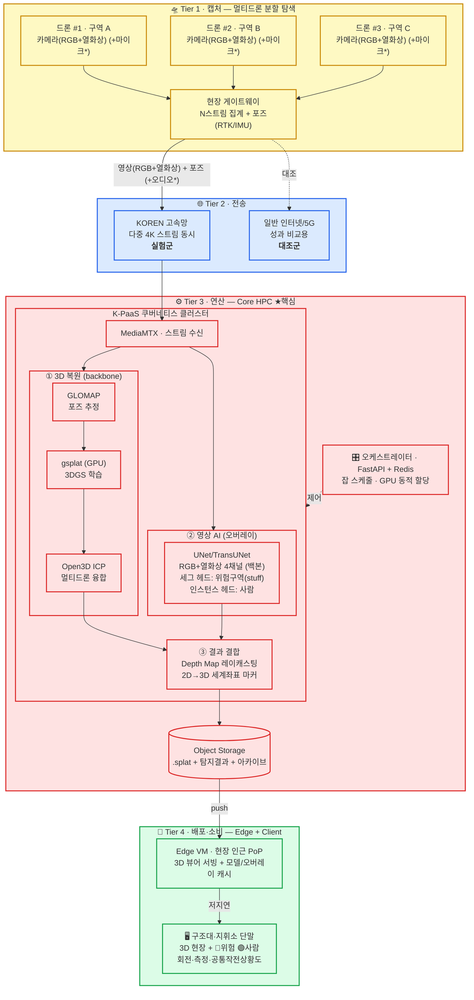

# 통합 아키텍처 — 멀티드론 실시간 3D 재난 인텔리전스

> NET 챌린지 캠프 시즌13 / 네트워크 구성도 상세 (★최종 방향: ③ 통합)
> 과제명(안): **멀티드론으로 무너진 현장을 실시간 3D로 복원하고, 그 위에 AI가 위험·사람을 표시하는 재난 인텔리전스 플랫폼**
> 한 줄 요약: **멀티드론 영상을 KOREN으로 Core HPC에 모아 현장을 실시간 3D로 복원하고(3DGS), 같은 영상에 AI(UNet, RGB+열화상 4채널)를 돌려 위험구역·사람을 감지한다. 2D 탐지 결과는 Depth Map 레이캐스팅으로 3D 좌표에 투영해 3D 현장 위에 오버레이하며, 가벼운 배포·서빙은 현장 인근 Edge VM에 분산하고, 일반망과 동시 측정해 KOREN 필연성을 정량 증명한다. (소리 기반 생존자 탐지는 확장)**

- **메인 (필수 데모)**: 멀티드론 → 현장 3D 복원(3DGS) + 영상 AI(UNet 4채널: 위험구역·사람) → Depth Map 레이캐스팅으로 3D 오버레이
- **확장 (발표 로드맵)**: 소리 AI 생존자 탐지(YAMNet 환경음 분류 + 사람 confidence 보정 + 삼각측량)
- **모달리티 융합 원칙**: latent(중간) 융합이 아니라 **Hybrid Fusion** — 모달리티마다 합쳐지는 단계가 다름(영상+열화상=입력단 / 포즈=투영단 / 소리=결정단)

---

## 0. 핵심 설계 사상 (3원칙)

| # | 원칙 | 의미 | 심사 방어 포인트 |
|---|---|---|---|
| 1 | **3D 복원이 backbone** | 현장을 *실제 형상*으로 복원, 그 위에 AI 결과를 얹음 | SkyeBrowse(단일·사후)와 차별 = 멀티드론·실시간 |
| 2 | **무거운 연산=Core HPC, 배포=Edge** | 3DGS 학습·AI 추론은 HPC GPU, 뷰어 서빙은 Edge VM | "엣지가 학습하냐" 오해 차단 |
| 3 | **같은 코드, 두 경로** | KOREN vs 일반망 동일 파이프라인 측정 | 깨끗한 대조 → 연구망 필연성 정량 증명 |

---

## 1. 전체 아키텍처 (4-Tier)


*그림. 최종 통합 모델 파이프라인. *

> Mermaid — GitHub · VS Code(mermaid 확장) · 노션 등에서 그래픽 렌더링.


> `*` 마이크/오디오 = 확장(소리 생존자 탐지) 경로. 메인 데모에서는 비활성.

### ASCII 버전 (렌더링 불가 환경용)

```
🛸 T1 캡처   드론 #1/#2/#3 (카메라[RGB+열화상]+포즈) → 현장 게이트웨이 집계
                              │ 영상(RGB+열화상) + 포즈(RTK/IMU)
                              ▼
🌐 T2 전송   [KOREN 고속망 · 다중 4K 동시]  ‖  [일반망 · 대조군]
                              ▼
⚙️ T3 연산 · Core HPC (K-PaaS)          ★핵심
   MediaMTX 수신 ─┬─► ① 3D복원: GLOMAP → gsplat(GPU) → ICP 융합
                 └─► ② 영상AI: UNet/TransUNet (RGB+열화상 4채널 · 위험·사람)
                          │
                          ▼ ③ 결합: Depth Map 레이캐스팅으로 2D→3D 세계좌표 마커
                     Object Storage (.splat + 탐지결과)
                              │ push
                              ▼
📡 T4 배포 · Edge VM (인근 PoP) : 3D 뷰어 서빙 + 캐시
                              │ 저지연
                              ▼
🖥️ 단말 : 3D 현장 + 🔴위험 🟢사람  → 지휘관 판단
```

---

## 2. 계층별 배포 명세

| 계층 | 위치 | 구성 요소 | 역할 | 무게 |
|---|---|---|---|---|
| **T1 캡처** | 현장 | 드론 2~3대 + 게이트웨이 | 영상·포즈 수집·집계 | — |
| **T2 전송** | KOREN | 고속망 (+ 일반망 대조군) | 다중 4K 스트림 동시 전송 | — |
| **T3 연산** | Core HPC | K-PaaS Pod: 3DGS복원 + UNet/TransUNet(RGB+열화상) + Depth Map 투영 / FastAPI·Redis | 3D 복원·AI 탐지·좌표 투영 | **무거움(GPU)** |
| **T4 배포** | Edge VM | 3D 뷰어 서버 + 모델/오버레이 캐시 | 저지연 서빙 | 가벼움 |
| **소비** | 단말 | 웹 3D 뷰어 (Three.js) | 3D+오버레이 시각화·측정 | 가벼움 |

---

## 3. 데이터 플로우 (핵심)

```
드론(영상+포즈) ─► 게이트웨이 집계 ─► KOREN ─► Core HPC
                                              │
                  ┌───────────────────────────┴───────────────────┐
                  ▼ ① 3D 복원 (backbone)            ▼ ② 영상 AI (오버레이)
        GLOMAP → gsplat → ICP 융합            UNet/TransUNet(RGB+열화상 4채널): 위험구역(stuff)·사람(인스턴스)
                  └───────────────┬───────────────┘
                                  ▼ ③ Depth Map 레이캐스팅으로 2D→3D 세계좌표 마커 (결합)
                       Object Storage (.splat + 마커)
                                  │ push
                                  ▼
                       Edge VM ─► 단말 3D 뷰어 ─► 지휘관
```

- **메인 데이터**: 영상(RGB+열화상, 무거움 → KOREN 대역폭) + 포즈(RTK/IMU, 가벼움 / 투영 파라미터)
- **핵심 차별**: 멀티드론 융합으로 사각 없는 3D + 그 위에 AI 위험·사람 마커
- **융합 방식**: latent 융합이 아닌 **Hybrid Fusion** — 영상+열화상(입력단 Early) / 포즈(투영단 Geometric) / 소리(결정단 Late). 상세는 [§3-A](#3-a-ai-모델융합-파이프라인-hybrid-fusion)
- **확장(소리)**: 마이크 → YAMNet 환경음 분류 → 생존자 의심지역의 사람 confidence 보정 + 다중 드론 삼각측량 → 🟢 생존자 마커

---

## 3-A. AI 모델·융합 파이프라인 (Hybrid Fusion)

> 멀티모달을 **latent(중간) 단위로 합치지 않는다.** 3DGS는 가우시안 포인트 집합이라 결합할 latent feature가 없고, 재난 현장의 영상·3D·생존자 라벨이 매칭된 end-to-end 멀티모달 학습 데이터셋도 존재하지 않는다. 또한 파이프라인을 분리해 두면 AI 탐지 모듈이 정지해도 지휘관은 3D 현장 맵(3DGS)을 계속 모니터링할 수 있어 **단일 장애점(SPOF)을 회피**한다. 따라서 모달리티마다 합쳐지는 단계가 다른 **Hybrid Fusion**으로 설계한다.

### 융합 단계 (어디서 합쳐지나)

| 단계 | 융합 유형 | 합쳐지는 것 | 방식 |
|---|---|---|---|
| ① 입력단 | **Early Fusion** (data/channel) | RGB ⊕ 열화상 | 4채널 concat → 단일 비전 모델 입력 |
| ② 투영 | **Geometric Registration** | 비전 2D 결과 + 포즈 + Depth Map | Depth Map 역참조 + 핀홀 역투영 → 3D 세계좌표 |
| ③ 결정단 | **Late Fusion** (decision) | 소리 분류 결과 → 사람 인스턴스 | confidence 보정 + UI 알림 |
| ④ 정밀화(옵션) | **Multi-view Triangulation** | 멀티드론 Ray 교차 | 위치 정밀화 |

> 공통 3D 좌표계에 실제로 등록(registration)되는 레이어는 **비전 결과(+3DGS 형상)뿐**이다. 포즈는 ②의 투영 파라미터, 소리는 ③의 confidence 변조 신호로 들어가며 *독립 3D 레이어가 아니다*.

### ① 영상 AI — UNet/TransUNet (RGB+열화상 4채널, 단일 백본·이중 헤드)

- **입력 (Early Fusion)**: RGB(3채널)와 열화상(1채널)을 결합한 4채널을 입력으로 받아, AI Hub("야간 사고 대응" 계열 등) RGB+열화상 데이터셋으로 처음부터 학습한다. 가시광이 약한 야간·연기 상황을 열화상이 보완하므로, 두 영상을 입력단에서 합쳐 단일 백본이 함께 학습하도록 설계했다.
- **구조 — 하나의 백본, 두 개의 헤드**: 4채널을 공유 인코더(백본)가 인코딩한 뒤 목적이 다른 두 출력 헤드로 분기한다. **(1) 세그멘테이션 헤드**는 지형과 위험구역을 영역(stuff) 단위 마스크로 분할하고, **(2) 인스턴스 헤드**는 사람을 개별 인스턴스('점 위치 + confidence')로 검출한다. 위험구역은 전경 객체가 아니라 일반 배경과 구분되는 '2차 배경(stuff)'이라 영역 분할이 적합하고, 사람은 잔해 속 소형 객체이자 이후 단계(②투영·③소리 보정)에서 '점 위치 + confidence'로 다뤄야 하므로 인스턴스로 분리했다. 두 작업이 같은 4채널 특징을 공유하므로 단일 백본 멀티태스크 구조가 연산 측면에서도 효율적이다.

**설계 철학 — 왜 검증된 세그멘테이션 백본인가.** 재난 대응 시스템에서 모델을 고르는 첫 번째 기준은 최신성이 아니라 신뢰성이다. 인명이 걸린 현장에서는 결과가 안정적으로 재현되고 실시간성을 보장하는 구조가, 잠재력은 크지만 거동이 불확실한 기법보다 우선한다. 최근 주목받는 VLM 기반 Open-Vocabulary 분할(자연어 프롬프트로 임의의 객체를 찾는 방식)도 후보로 검토했으나, 연산이 무거워 30초 준실시간 갱신을 위협하고 출력이 프롬프트에 민감해 동일한 입력에도 판단이 흔들릴 수 있다. 반면 UNet 계열은 분할 분야에서 오래 검증된 표준 구조로 RGB+열화상 4채널로 확장하기 쉽고, 추론이 가볍고 빠르며 결과가 일관적이다. 따라서 구조대원이 진입 판단에 믿고 쓸 수 있는 **안정성과 실시간성**을 최우선으로, 검증된 4채널 세그멘테이션 백본을 채택했다.


*그림. 영상 AI 백본(UNet 계열). 입력단을 RGB+열화상 4채널로 확장하고, 공유 백본에서 세그멘테이션 헤드(위험구역 stuff)와 인스턴스 헤드(사람)로 분기한다.*

### ② 2D→3D 결합 — Depth Map 레이캐스팅 (Core HPC에서 1회 산출)

- 3D 가우시안에 직접 레이캐스팅(무겁고 노이즈)하지 않고, **복원된 3DGS를 '탐지 프레임의 드론 포즈'로 렌더할 때 나오는 Depth Map(Z-Buffer)을 역참조**한다. (깊이는 드론 센서 출력이 아니라 렌더링 부산물)
- 핀홀 역투영으로 카메라 로컬 3D를 구한 뒤 포즈 $[R\mid t]$로 세계좌표 변환:

$$X_c = \frac{(u-c_x)Z}{f_x},\quad Y_c = \frac{(v-c_y)Z}{f_y},\quad Z_c = Z \;\;\xrightarrow{[R\mid t]}\;\; (X_w, Y_w, Z_w)$$

- **실행 위치 = Core HPC.** 마커는 여기서 **세계좌표로 1회 고정**(시점 무관)되어 Object Storage(`.splat + 마커`)에 저장·Edge로 push되고, **Edge 뷰어는 받아서 표시만** 한다(투영 재계산 없음).
- **포즈(RTK/IMU)는 입력 모달리티가 아니라 이 투영의 외부 파라미터(extrinsics)** 로 쓰인다 → 비용 때문에 완전히 빼지는 않고 활용 정밀도만 조정.
- 보정 트릭: 멀티드론 **삼각측량**(Ray 교차로 노이즈 감소), **지표면 강제 투영**(마커가 공중에 뜨는 버그 방지).

### ③ 소리 AI — YAMNet (확장)

- 별도 경량 모델(**YAMNet**, MobileNet 기반)로 환경음(신음·기침·타격음·구조요청)을 분류 → **생존자 의심 지역** 판정 → 해당 **사람 인스턴스의 confidence를 상향**(놓침=false negative 감소) + **UI 알림** (Late Fusion). 마이크 다중 시 **majority voting**.
- **WavLM(SOTA) 대신 YAMNet인 이유**: ① MobileNet 기반 초경량으로 **CPU 실시간** 추론 → 3DGS의 GPU 자원을 뺏지 않음, ② 우리 목적은 음성 인식이 아니라 **환경음 탐지**(YAMNet은 AudioSet 521개 환경음 클래스), ③ `Crying/Yell/Groan/Knock` 클래스를 이미 보유해 **zero-shot로 데모 가능**. 데이터셋은 **DroneAudioset**으로 추가 파인튜닝 가능.


*그림. 소리 AI(YAMNet). 경량 CNN으로 환경음을 분류해 생존자 의심 지역을 산출한다.*

### 최종 통합 모델 구조

> 아래 그림은 영상(UNet 4채널)·소리(YAMNet)·포즈를 Hybrid Fusion으로 결합해 3D 위에 마커를 얹는 전체 추론 파이프라인을 나타낸다.


*그림. 최종 통합 모델 구조. *

---

## 4. KOREN/HPC 필연성 = 성과지표 (대조 측정)

| 측정 항목 | 일반망/로컬 | KOREN/HPC·Edge | 증명 |
|---|---|---|---|
| 다중 4K 스트림 동시 전송 손실/지연 | (대조군) | (실험군) | 멀티드론 전송 필연 |
| 멀티드론→3D 갱신 end-to-end 지연 | (대조군) | (실험군) | 준실시간 복원 필연 |
| 3DGS 학습 + UNet(RGB+열화상) 추론 시간 | (로컬 PC) | (HPC GPU) | HPC GPU 필연 |
| Edge 배포 첫 3D 표시 시간(TTFV) | (대조군) | (실험군) | Edge 저지연 배포 필연 |

---

## 5. 기술 스택

| 영역 | 기술 |
|---|---|
| 드론/캡처 | DJI M30T·M300 RTK (RGB+열화상 영상 + RTK포즈) / PoC: 스마트폰 ARCore |
| 전송 | SRT·WebRTC + MediaMTX, FFmpeg |
| 포즈 추정 | GLOMAP / COLMAP (+RTK·IMU prior) |
| 3D 복원 | gsplat (Nerfstudio), 융합: Open3D ICP |
| 영상 AI | **UNet / TransUNet** (RGB+열화상 4채널 세그멘테이션; 위험구역=stuff, 사람=인스턴스) |
| 2D→3D 결합 | **Depth Map 레이캐스팅** (핀홀 역투영, Core HPC에서 세계좌표 마커 산출) |
| 모달리티 융합 | **Hybrid Fusion** — Early(RGB+열화상) / Geometric Reg.(포즈) / Late(소리) |
| 뷰어 | Three.js GaussianSplats3D / SuperSplat (+ 오버레이 레이어) |
| 오케스트레이션 | K-PaaS(K8s) + FastAPI + Redis |
| 인프라 | KOREN HPC(GPU) + Edge VM + Object Storage |
| (확장) 소리 | MEMS 마이크 + **YAMNet** 환경음 분류 + 사람 confidence 보정 + 삼각측량 (+AI 소음억제) |

---

## 6. 데모 시나리오

1. 드론 2~3대(또는 스마트폰) → 캠퍼스/모형 건물 분할 촬영
2. Core HPC: 30초 주기 3D 복원 + UNet(RGB+열화상)로 위험·사람 감지 → Depth Map 레이캐스팅으로 3D 세계좌표 마커 산출
3. Edge VM 뷰어: Core가 내려준 **3D 현장(.splat) 위에 🔴위험·🟢사람 마커** 회전·측정 (표시 전용)
4. **일반망 vs KOREN** 복원 지연·동시 스트림 손실 비교 그래프
5. (발표 멘트) "여기에 소리 AI를 더하면 잔해 속 생존자까지 탐지 가능" → 확장 로드맵

---

## 7. 리스크 & 대안

| 리스크 | 대안 |
|---|---|
| 프레임단위 완전 실시간 3DGS는 무리 | 30초 주기 준실시간 + 증분 SLAM 로드맵 |
| 3D 복원 + AI 둘 다 = 작업량 | 소리는 확장으로 분리, 메인은 3D+영상AI만 |
| 포즈 추정이 품질 좌우 | RTK/IMU prior로 SfM 부담↓ |
| 드론 하드웨어·비행규제 | 스마트폰 PoC, 실내·캠퍼스 모형 데모 |

---

> 이 문서가 최종 방향(③ 통합)입니다. 이전 `인프라_아키텍처.md`(순수 3D)·`SkyLens_아키텍처.md`(소리 중심)는 참고용 이전 버전.
