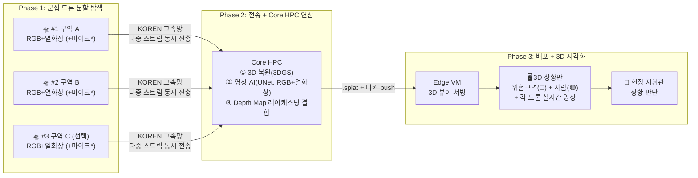
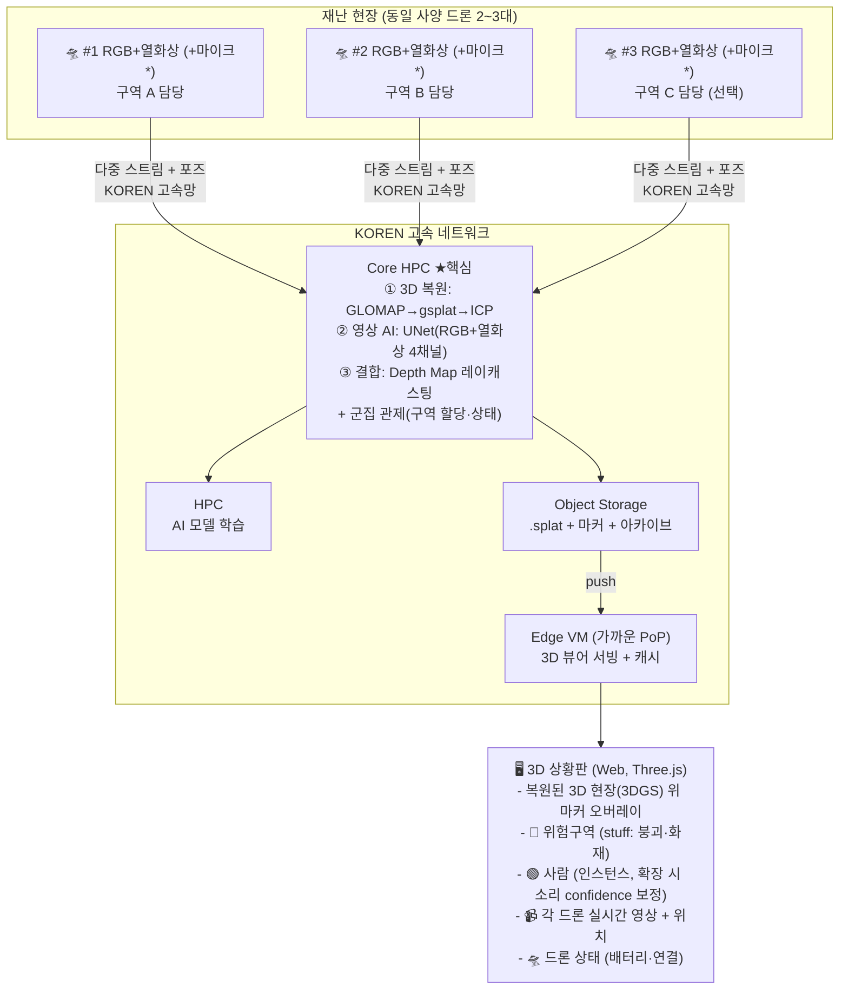

---
tags:
  - project
  - 넷챌린지
  - brainstorm
  - drone
  - 3D
parent: '[[넷 챌린지 캠프]]'
---
## 과제명 (안)

**"SkyLens: 멀티드론 영상을 KOREN 분산 AI로 실시간 3D 복원하고, 그 위에 위험구역·사람을 AI로 표시하는 재난 인텔리전스 플랫폼 (소리 기반 생존자 탐지는 확장)"**

---

## 문제 정의

소방드론은 최근 5년간 출동 건수가 2019년 738건에서 2024년 4,600건으로 6배 이상 급증했고 [^f1] [^f7], 전국 소방관서에 554대가 배치되어 있을 만큼 재난 현장의 핵심 장비로 자리잡았다. 그러나 현재 소방드론이 하는 일은 **실시간 영상 중계**가 전부다 [^f2]. AI로 위험 요소를 자동 감지하거나, 소리를 수집해 생존자를 탐지하는 기능은 없다. 소방청도 이 한계를 인식해 '소방드론 협의회'를 신설했고 [^f8], 충남도가 별도로 "드론영상 AI 분석시스템 구축"에 나서고 있다는 사실 자체가 현재 AI 분석이 부재함을 보여준다 [^f9].

현장 정보가 부족하면 구조 대원의 안전이 직접적으로 위협받는다. 2001년 홍제동 화재에서는 내부 구조를 파악하지 못한 채 진입한 소방관 10명이 건물 붕괴로 매몰되어 6명이 사망했다 [^f3]. 만약 드론이 진입 전에 건물의 균열이나 붕괴 징후를 AI로 감지하고, 소리를 통해 생존자 위치를 추정할 수 있었다면 대원들의 진입 판단이 달라졌을 것이다.

한편, 기존 드론 기반 생존자 탐지는 열영상 카메라에 의존하지만 잔해가 두꺼우면 2m 깊이까지만 탐지할 수 있다 [^f5]. 소리를 활용하면 더 깊은 곳의 생존자도 찾을 수 있지만, 드론 프로펠러 소음(약 80dB)이 인간 음성(약 60dB)을 압도하여 사실상 불가능했다. 그런데 2024년 시바우라공업대학의 연구에서 AI 기반 소음 억제 시스템이 개발되어 프로펠러 소음을 실시간으로 제거하면서 인간 음성을 증폭할 수 있게 되었고 [^f6], 2025년에는 드론 탐색구조(SAR)용 오디오 데이터셋 'DroneAudioset'이 공개되어 학습 데이터도 확보되었다 [^f13]. 소리 기반 생존자 탐지의 기술적 장벽이 해소되고 있는 것이다.

KISTI의 보고서도 재난 상황에서 객체 탐지를 위해서는 영상 인식만으로는 부족하며 **영상·음성·문자 인지를 통합한 모델**이 필요하다고 지적하고 있다 [^f14]. 현재 이러한 통합 인지 드론 AI 플랫폼은 상용화되어 있지 않다.

[^f1]: [재난현장 소방드론 출동, 3년 만에 2.7배 급증 — YTN사이언스](https://m.science.ytn.co.kr/program/view.php?s_mcd=0082&key=202502261103135052)
[^f2]: [재난상황 대응, 드론으로 효율성 높여 — KNN](https://news.knn.co.kr/news/article/157652)
[^f3]: [진화중 매몰 소방관 6명 사망 그후 — 오마이뉴스](https://www.ohmynews.com/NWS_Web/View/at_pg.aspx?CNTN_CD=A0000034520)
[^f4]: [17명 사상자 낸 광주 학동참사 책임자들 유죄 확정 — 법률신문](https://www.lawtimes.co.kr/news/articleView.html?idxno=210516)
[^f5]: [AI-Based Drone Assisted Human Rescue in Disaster Environments — Springer](https://link.springer.com/article/10.1134/S1054661824010152)
[^f6]: [Advanced noise suppression technology for improved SAR drones — ScienceDaily](https://www.sciencedaily.com/releases/2024/03/240306145036.htm)
[^f7]: [5년간 소방드론 출동 4배 늘어, 전문인력 양성 — 시정일보](https://www.sijung.co.kr/news/articleView.html?idxno=310033)
[^f8]: [전문가 모여 '소방드론' 재난현장 미래전략 구축 — 소방청](https://nfa.go.kr/nfa/news/pressrelease/press/?boardId=bbs_0000000000000010&mode=view&cntId=2638)
[^f9]: [충남도, 재난대응시스템에 드론·인공지능 접목한다 — 보안뉴스](https://m.boannews.com/html/detail.html?idx=130103)
[^f10]: [지난 10년간 위험직무 수행 중 소방관 42명 순직 — 경향신문](https://www.khan.co.kr/article/202402021321001)
[^f11]: [증가하는 소방공무원 순직·공상자…반복되는 비극 — 한국경제](https://www.hankyung.com/article/202402070719i)
[^f12]: [2015년 의정부 아파트 화재 경기도 책임 다시 따져봐야 — 불교방송](https://news.bbsi.co.kr/news/articleView.html?idxno=3145453)
[^f13]: [DroneAudioset: An Audio Dataset for Drone-based SAR — arxiv](https://arxiv.org/pdf/2510.15383)
[^f14]: [재난/위급 상황 대처를 위한 통합 인지 드론 AI 개발 — KISTI](https://scienceon.kisti.re.kr/srch/selectPORSrchReport.do?cn=TRKO202300005246)

---

## 해결 방법

SkyLens는 세 단계로 동작한다. 먼저, 동일 사양(RGB+열화상 카메라, 확장 시 마이크)의 **2~3대 드론**에 탐색 구역을 자동 할당하고 현장을 분할 탐색한다. 각 드론이 수집한 영상과 포즈를 KOREN 고속망으로 **Core HPC**에 모아 현장을 **실시간 3D(3DGS)로 복원**한다. 동시에 같은 영상에 **AI(UNet, RGB+열화상 4채널)** 를 돌려 붕괴·화재 등 **위험구역(stuff)** 과 **사람(인스턴스)** 을 감지하고, 2D 탐지 결과를 **Depth Map 레이캐스팅**으로 3D 좌표에 투영해 복원된 3D 현장 위에 마커로 올린다. 무거운 연산(3D 복원·AI 추론·좌표 투영)은 Core HPC가 맡고, 가벼운 3D 뷰어 서빙은 현장 인근 **Edge VM**이 맡는다. 지휘관은 이 3D 상황판에서 **위험구역과 요구조자의 추정 위치**를 한눈에 확인하고 대응을 판단한다. (소리 기반 생존자 탐지는 확장: **YAMNet** 환경음 분류로 생존자 의심 지역의 사람 confidence를 보정.)

### 군집 운용 효과

| 항목 | 단일 드론 | 군집 (2~3대) |
|---|---|---|
| 탐색 범위 | 1개 구역 순차 탐색 | **2~3개 구역 동시 탐색** |
| 탐색 속도 | ×1 | **×2~3** |
| 소리 위치 추정 | ❌ (단일 지점) | ✅ **다중 드론 위치로 소리 발생 위치 삼각측량 가능** |
| 장애 대응 | 1대 이상 시 관측 불가 | 잔여 드론이 **커버 가능** |

### 기존 방식과의 차이

- 기존 재난 구조 분야에서 드론 활용 방식과 SkyLens

| | 기존 소방드론 | 상용 3D 매핑 드론 (DJI 등) | SkyLens |
|---|---|---|---|
| 영상 | 실시간 중계만 | 사후 3D 모델링 (비실시간) | **실시간 3D 복원(3DGS) + AI 오버레이** |
| 3D 시각화 | ❌ | ✅ (사후 정밀 모델) | ✅ **멀티드론 실시간 3D 복원 위 AI 마커** |
| 위험·사람 감지 | 육안 판단 | 사후 분석 | ✅ **실시간 AI 자동 감지 (UNet, RGB+열화상 4채널)** |
| 2D→3D 결합 | ❌ | ❌ | ✅ **Depth Map 레이캐스팅으로 3D 좌표 투영** |
| 생존자 탐지(소리) | 열영상 (2m 한계) | ❌ | ✅ **(확장) YAMNet 환경음 분류 → 사람 confidence 보정** |
| 군집 운용 | ❌ (1대 운용) | ❌ | ✅ **구역 분할 + 상태 모니터링 + 데이터 통합** |
| KOREN 활용 | ❌ | ❌ | ✅ **고속 전송 + Core HPC 분산 AI** |

---

## 아키텍처

---

## KOREN 활용

| KOREN 자원 | 활용 내용 | 개선 효과 |
|---|---|---|
| **고속 네트워크 (10Gbps+)** | 군집 드론 2~3대의 다중 영상(RGB+열화상)+포즈 스트림 **동시** 실시간 전송 | 4K×2~3대 동시 전송 (일반 LTE/5G로는 다중 드론 스트림 병목) |
| **Core HPC (GPU)** | **무거운 연산**: 3DGS 복원 + UNet(RGB+열화상) 추론 + Depth Map 투영(마커 산출) + AI 모델 학습 | 드론 온보드·로컬 PC로 불가능한 고성능 실시간 연산 |
| **Edge VM (가까운 PoP)** | **가벼운 배포**: 3D 뷰어 서빙 + 모델/오버레이 캐시 | 단말까지 **저지연** 3D 표시 (TTFV↓) |
| **Object Storage** | `.splat + 마커 + 영상` 아카이브 | 사후 분석 + 학습 데이터 축적 |

---

## 예상 기술 스택

| 영역 | 기술 | 비고 |
|---|---|---|
| 드론 영상 | **SRT/WebRTC** + MediaMTX, FFmpeg | RGB+열화상 영상 실시간 전송 |
| 포즈 | **RTK/IMU** + GLOMAP/COLMAP prior | 2D→3D 투영의 외부 파라미터(extrinsics) |
| 3D 복원 (backbone) | **gsplat(3DGS)** + GLOMAP 포즈추정 + Open3D ICP 융합 | 멀티드론 영상으로 현장 실시간 3D 복원 |
| 영상 AI | **UNet / TransUNet** (RGB+열화상 4채널, 단일 백본·이중 헤드) | 세그 헤드=위험구역(stuff), 인스턴스 헤드=사람 |
| 2D→3D 결합 | **Depth Map 레이캐스팅** (핀홀 역투영) | Core HPC에서 세계좌표 마커 산출 |
| 모달리티 융합 | **Hybrid Fusion** | Early(RGB+열화상) / Geometric(포즈) / Late(소리) |
| 소리 AI (확장) | **YAMNet** 환경음 분류 + MEMS 마이크 (+AI 소음억제) | 생존자 의심지역 사람 confidence 보정 + UI 알림 |
| 3D 뷰어 | **Three.js** GaussianSplats3D / SuperSplat | 복원된 3D 현장 위 AI 마커 오버레이 |
| 군집 관제 | **Python** 구역 할당 + WebSocket 상태 수신 | 드론별 구역 분할, 배터리·연결 모니터링 |
| 백엔드/오케스트레이션 | **FastAPI** + Redis + K-PaaS(K8s) | 실시간 이벤트 + GPU 잡 스케줄 |
| 프론트엔드 | **React** + Three.js | 3D 상황판 + 드론 관제 대시보드 |
| 인프라 | Docker / K-PaaS | Core HPC(GPU) + Edge VM + Object Storage |

---

## 시연 시나리오

1. **드론 대체 시뮬레이션**: 시연장에서 드론 대신 **웹캠(여러 시점)**으로 "현장 영상" 입력 (사전 촬영한 재난 현장/모형 영상도 가능, 확장 시 마이크 추가)
2. **Phase 1 — 수집·전송**: 멀티 시점 영상 + 포즈가 KOREN을 통해 **Core HPC**로 실시간 스트리밍
3. **Phase 2 — Core HPC 연산**:
   - 3D 복원: 멀티 시점 영상으로 현장을 **3D(3DGS) 복원**
   - 영상 AI(UNet, RGB+열화상): "붕괴 잔해·화재 구역 → 위험구역(stuff)", "사람 → 인스턴스" 감지
   - 결합: **Depth Map 레이캐스팅**으로 2D 탐지를 3D 세계좌표 마커로 투영 → `.splat + 마커` 저장·Edge push
   - (확장) 소리 AI(YAMNet): "구조 요청·환경음 감지" → 해당 지역 사람 confidence 보정 + UI 알림
4. **Phase 3 — 3D 상황판**: Edge VM이 서빙하는 **Three.js 뷰어**에서 복원된 3D 현장 위에 위험구역(🔴) + 사람(🟢) 마커를 회전·측정 + 일반망 vs KOREN 비교

---

## 리스크 및 고려사항

| 리스크 | 대응 방안 |
|---|---|
| 다중 드론 통합 복잡도 | MVP는 **드론 1~2대**로 시작, 이후 확장 |
| 프레임 단위 완전 실시간 3DGS는 부담 | **30초 주기 준실시간** 복원 + 증분 SLAM 로드맵 |
| 3D 복원 + 영상 AI 동시 = 작업량 | **소리는 확장으로 분리**, 메인은 3D 복원 + 영상 AI(UNet) |
| 포즈 추정 품질이 투영 정확도 좌우 | RTK/IMU prior로 SfM 부담↓, 멀티드론 삼각측량으로 보정 |
| 드론 하드웨어·비행 규제 | 스마트폰/웹캠 PoC, 실내·캠퍼스 모형 데모 |

---

## AI 모델 구조도

> 상세 파이프라인은 [ARCHITECTURE.md](ARCHITECTURE.md) §3-A 참조.

**영상 AI — UNet/TransUNet (RGB+열화상 4채널, 단일 백본 + 세그/인스턴스 이중 헤드)**

**소리 AI(확장) — YAMNet (경량 환경음 분류)**

**최종 통합 모델**

